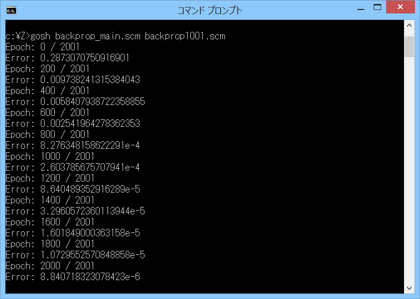

# backprop-test



## 概要
- Gauche を使って、バックプロパゲーションによる学習を行うプログラムです。  
  出典は以下になります。  
  「はじめてのディープラーニング」 我妻幸長 SB Creative 2018  
    (「5.9 バックプロパゲーションの実装 -回帰-」)


## 内容
- 内容は以下の通りです。  
  また、最終結果をグラフにしたものを、以下のページに置いています。  
  https://drive.google.com/open?id=181qX5J1A5pdydF6f8dpxpxmgWrc2_YRPhEAxmr0oge8  
  (シート名がパラメータ設定ファイルの番号に対応しています)

  - backprop_main.scm  
    バックプロパゲーションによって、  
    ニューラルネットワークの重みとバイアスのパラメータを更新して、  
    指定した関数の学習を行うプログラムです。  
    参考書のソースのアルゴリズムを、ほぼそのまま Gauche に移植しました。  
    ただし、高速化のために計算用の行列を追加したり、複合演算命令を使用したりしています。  
    また、中間層の数の設定と、活性化関数 (シグモイド / ReLU) の選択を可能としました。  
    実行方法は、以下のようになります。  
    ```
    gosh backprop_main.scm paramfile
    ```
    ここで、paramfile は、パラメータ設定ファイル (backprop1001.scm 等) です。  
    実行すると、学習を行い、最終結果 ((x,y)の組のデータ) を、  
    パラメータ設定ファイルに設定した出力ファイル (backprop_result1001.txt 等) へと出力します。

  - backprop1001.scm  
    sin 関数の学習を行うパラメータ設定ファイルです。

  - backprop1011.scm  
    backprop1001.scm で、入力の範囲を正規化しなかったパラメータ設定ファイルです。

  - backprop1041.scm  
    backprop1001.scm で、活性化関数を ReLU 関数にし、中間層の数を2に増やし、  
    中間層のニューロン数も10に増やしたパラメータ設定ファイルです。

  - backprop1061.scm  
    学習する関数を sin(x) + sin(2 * x) にしたパラメータ設定ファイルです。

  - backprop1081.scm  
    学習する関数を mod(x, 2) - 1 にしたパラメータ設定ファイルです (のこぎり波) 。

  - backprop1091.scm  
    学習する関数を (2 / pi) * asin(sin(x)) にしたパラメータ設定ファイルです (三角波) 。

  - backprop1101.scm  
    学習する関数を mod(x * pi, 2) - 1 にしたパラメータ設定ファイルです (のこぎり波の歯の数を増やした) 。

  - backprop1201.scm  
    学習する関数を sin(x * pi * 3) > 0 ? 1 : -1 にしたパラメータ設定ファイルです (方形波) 。


## その他 注意事項等
1. 同梱の f2arrmat.scm を読み込んで使用するため、同一フォルダに置いてください。  
   また、eigenmat モジュール ( https://github.com/Hamayama/eigenmat )  
   および、blasmat モジュール ( https://github.com/Hamayama/blasmat )  
   が存在すれば、使用します (環境によっては、10倍以上速くなります)。

2. プログラムについての説明をもう少し、以下のページに載せています。  
   https://practical-scheme.net/wiliki/wiliki.cgi?Gauche%3A%E3%83%90%E3%83%83%E3%82%AF%E3%83%97%E3%83%AD%E3%83%91%E3%82%B2%E3%83%BC%E3%82%B7%E3%83%A7%E3%83%B3


## 環境等
- OS
  - Windows 8.1 (64bit)
- 環境
  - MSYS2/MinGW-w64 (64bit/32bit) (gcc version 7.3.0 (Rev2, Built by MSYS2 project))
- 言語
  - Gauche v0.9.7

## 履歴
- 2019-3-1   v1.00 (初版)
- 2019-3-2   v1.01 f64arraysub.scmをv1.01に更新(行列のコピー見直し等)
- 2019-3-4   v1.02 backprop1051.scmを追加  
  f64arraysub.scmをv1.02に更新(多数の見直し、デバッグ、テスト追加)
- 2019-3-5   v1.03 f64arraysub.scmをv1.03に更新(コメント、テスト変更等)
- 2019-3-5   v1.04 f64arraysub.scmをv1.04に更新(f64array-transposeの見直し)
- 2019-3-5   v1.05 f64arraysub.scmをv1.05に更新(f64array-copyの見直し)
- 2019-3-8   v1.10 コメント変更等  
  f64arraysub.scmをv1.10に更新(make-f64array-same-shapeを追加)
- 2019-3-9   v1.11 backprop1061.scmを追加。その他、コメント追加等  
  f64arraysub.scmをv1.11に更新(コメント、テスト追加)
- 2019-3-9   v1.12 backprop1071.scmを追加。その他、コメント追加等
- 2019-3-9   v1.13 f64arraysub.scmをv1.13に更新(f64array-copy!,f64array-map!を追加)
- 2019-3-11  v1.14 backprop1051/1061/1071.scmを変更(転置行列を破壊的変更で作成)  
  f64arraysub.scmをv1.14に更新(f64array-transpose!,f64array-row!,f64array-col!を追加)
- 2019-3-11  v1.15 backprop1061/1071.scmを変更(エポック数を増やした)
- 2019-3-11  v1.16 backprop1051/1061/1071.scmを変更(転置行列の初期化見直し)  
  f64arraysub.scmをv1.16に更新(コメント追加)
- 2019-3-11  v1.17 f64arraysub.scmをv1.17に更新(array-copy!を修正)
- 2019-3-13  v1.18 backprop1081/1091.scmを追加
- 2019-3-13  v2.00 全体見直し。本体とパラメータ設定ファイルを分離した。
- 2019-3-13  v2.01 ファイル名見直し
- 2019-3-14  v2.02 f64arraysub.scmをv2.02に更新(プログラムの整理、エラーチェック追加等)
- 2019-3-19  v2.10 f64arrmat.scmを使うように変更(行列のキャッシュ処理追加等)
- 2019-3-20  v2.20 farrmat.scmを使うように変更(手続き名見直し等)
- 2019-3-20  v2.30 f2arrmat.scmを使うように変更(手続き名見直し等)
- 2019-3-21  v2.31 f2arrmat.scmをv1.01に更新(コメント変更のみ)
- 2019-3-21  v2.32 backprop_main.scmを変更(blasmat用に最適化)  
  f2arrmat.scmをv1.02に更新(blasmat関連の変更)
- 2019-3-23  v2.33 f2arrmat.scmをv1.04に更新(手続きの追加等)
- 2019-3-23  v2.34 f2arrmat.scmをv1.05に更新(プログラムの整理等)
- 2019-3-24  v2.35 f2arrmat.scmをv1.06に更新(プログラムの整理等)
- 2019-3-24  v2.36 backprop1101.scmを追加(のこぎり波)
- 2019-3-27  v2.37 backprop_main.scmを変更(コメント変更のみ)
- 2019-3-27  v2.38 backprop_main.scmを変更(演算処理見直し等)  
  f2arrmat.scmをv1.07に更新(演算処理見直し等)
- 2019-3-27  v2.39 backprop1201.scmを追加(方形波)
- 2019-3-27  v2.40 backprop_main.scmを変更(書式整形のみ)


(2019-3-27)
