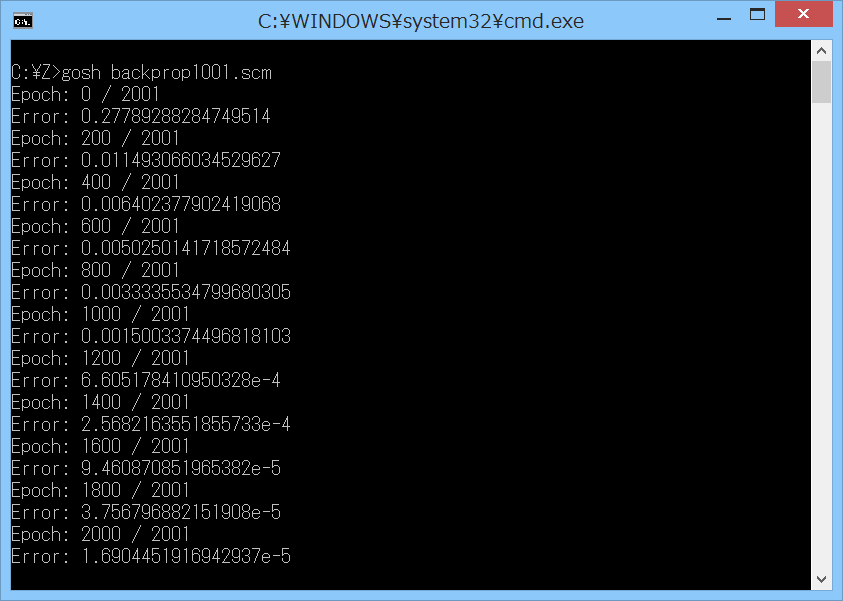

# backprop-test

## 概要
- Gauche を使って、バックプロパゲーションによる学習を行うプログラムです。  
  出典は以下になります。  
  「はじめてのディープラーニング」 我妻幸長 SB Creative 2018  
    (「5.9 バックプロパゲーションの実装 -回帰-」)

## 内容
- 内容は以下の通りです。  
  また、最終結果をグラフにしたものを、以下のページに置いています。  
  https://drive.google.com/open?id=1CyYuqu66ZHT9qySN0OarFxHbO2bNZG_wiDMcQkbHaXo  
  (シート名がファイル名の番号に対応しています)

  - backprop1001.scm  
    バックプロパゲーションによって、  
    ニューラルネットワークの重みとバイアスのパラメータを更新して、  
    sin 関数の学習を行います。  
    参考書のソースのアルゴリズムを、ほぼそのまま Gauche に移植しました。  
    実行すると、学習の最終結果 ((x,y)の組のデータ) を、  
    backprop_result1001.txt に出力します。

  - backprop1011.scm  
    backprop1001.scm で、入力の範囲を正規化しなかったものです。

  - backprop1021.scm  
    backprop1001.scm で、活性化関数を ReLU 関数にしたものです。

  - backprop1031.scm  
    backprop1001.scm で、活性化関数を ReLU 関数にし、中間層の数を1増やしたものです。

  - backprop1041.scm  
    backprop1001.scm で、活性化関数を ReLU 関数にし、中間層の数を1増やし、  
    中間層のニューロン数も3増やしたものです。

  - backprop1051.scm  
    backprop1001.scm で、行列の破壊的変更を行うようにしたものです。

  - backprop1061.scm  
    backprop1051.scm で、学習する関数を sin(x) + sin(2 * x) にしたものです。  
    また、中間層の数を設定可能にしました。

  - backprop1071.scm  
    backprop1051.scm で、学習する関数を max(0, sin(x) + sin(2 * x)) にしたものです。  
    また、中間層の数と活性化関数を設定可能にしました。

  - backprop1081.scm  
    backprop1071.scm で、学習する関数を mod(x, 2) - 1 にしたものです (のこぎり波) 。

  - backprop1091.scm  
    backprop1071.scm で、学習する関数を (2 / pi) * asin(sin(x)) にしたものです (三角波) 。

## その他 注意事項等
1. 同梱の f64arraysub.scm を読み込んで使用するため、同一フォルダに置いてください。  
   また、eigenmat モジュール ( https://github.com/Hamayama/eigenmat )  
   が存在すれば、使用します (環境によっては、5倍程度速くなります)。

2. プログラムについての説明をもう少し、以下のページに載せています。  
   https://practical-scheme.net/wiliki/wiliki.cgi?Gauche%3A%E3%83%90%E3%83%83%E3%82%AF%E3%83%97%E3%83%AD%E3%83%91%E3%82%B2%E3%83%BC%E3%82%B7%E3%83%A7%E3%83%B3

## 環境等
- OS
  - Windows 8.1 (64bit)
- 環境
  - MSYS2/MinGW-w64 (64bit/32bit) (gcc version 7.3.0 (Rev2, Built by MSYS2 project))
- 言語
  - Gauche v0.9.7

## 履歴
- 2019-3-1   v1.00 (初版)
- 2019-3-2   v1.01 f64arraysub.scmをv1.01に更新(行列のコピー見直し等)
- 2019-3-4   v1.02 backprop1051.scmを追加  
  f64arraysub.scmをv1.02に更新(多数の見直し、デバッグ、テスト追加)
- 2019-3-5   v1.03 f64arraysub.scmをv1.03に更新(コメント、テスト変更等)
- 2019-3-5   v1.04 f64arraysub.scmをv1.04に更新(f64array-transposeの見直し)
- 2019-3-5   v1.05 f64arraysub.scmをv1.05に更新(f64array-copyの見直し)
- 2019-3-8   v1.10 コメント変更等  
  f64arraysub.scmをv1.10に更新(make-f64array-same-shapeを追加)
- 2019-3-9   v1.11 backprop1061.scmを追加。その他、コメント追加等  
  f64arraysub.scmをv1.11に更新(コメント、テスト追加)
- 2019-3-9   v1.12 backprop1071.scmを追加。その他、コメント追加等
- 2019-3-9   v1.13 f64arraysub.scmをv1.13に更新(f64array-copy!,f64array-map!を追加)
- 2019-3-11  v1.14 backprop1051/1061/1071.scmを変更(転置行列を破壊的変更で作成)  
  f64arraysub.scmをv1.14に更新(f64array-transpose!,f64array-row!,f64array-col!を追加)
- 2019-3-11  v1.15 backprop1061/1071.scmを変更(エポック数を増やした)
- 2019-3-11  v1.16 backprop1051/1061/1071.scmを変更(転置行列の初期化見直し)  
  f64arraysub.scmをv1.16に更新(コメント追加)
- 2019-3-11  v1.17 f64arraysub.scmをv1.17に更新(array-copy!を修正)
- 2019-3-13  v1.18 backprop1081/1091.scmを追加

(2019-3-13)
